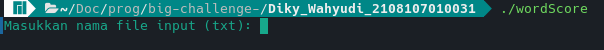
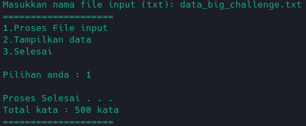
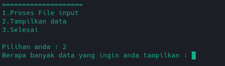
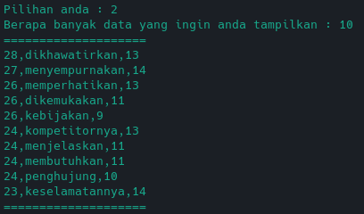
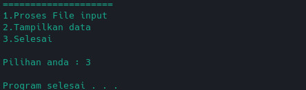

# Tugas UAS : Big Challenge
 

## Nama : Diky Wahyudi
## NPM  : 2108107010031

 

Link video Youtube : [https://youtu.be/9IaYoAOlfD8](https://youtu.be/9IaYoAOlfD8)

### Cara melakukan compile

1. Menggunakan <b>makefile</b>
> `make wordscore`

2. Jika tidak bisa menggunakan <b>makefile</b> maka gunakan perintah dibawah ini
> `gcc -o wordScore wordScore.c imple.c -Wall`

### Cara menjalankan program
1. Pada Windows
> `./wordscore.exe`

2. Pada Linux
> `./wordscore`

### Cara penggunaan program

1. Input nama file yang akan di proses
> 

2. Pilih pilihan 1 untuk melakukan pemprosesan pada file input
> 

3. Pilih pilihan 2 untuk menampilkan data
> 

4. Masukkan berapa banyak data yang akan di tampilkan
> 

5. Keluar dari program
> 
